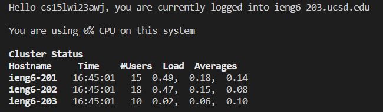

# Accessing the course specific account on ieng6:

## Installing Visual Studio Code:
* In order to access the course specific account you will need some type of code editor, the standard for the class is Visual Studio Code
* Regardless of the OS going to the Visual Studio Code website should give straight forward instructions on how to install Visual Studio Code
* Once Visual Studio Code is installed you can launch it and it might have a welcome file already open however with no files open your screen should display as:

## Accessing the class specific account:
* Upon entering the class the school should have generated login credentials specific to the student, such as cse15lwi23xxx
* To use this login, simply open the terminal and type **ssh cse15lwi23xxx@ieng6.ucsd.edu**, this should prompt you with a password request, after typing that in you should be logged into the course server. Do not be worried that you cant see the password when you type it, that is standard.
* Upon logging in you should be prompted with a welcoming message such as:

## Trying commands in the school account:
* After logging into the school account, you should have access to your files in the school database, there wont be much as this is the start of the class but you will fill them as the class goes on
* Go ahead and test out some commands, they might look something like this:

