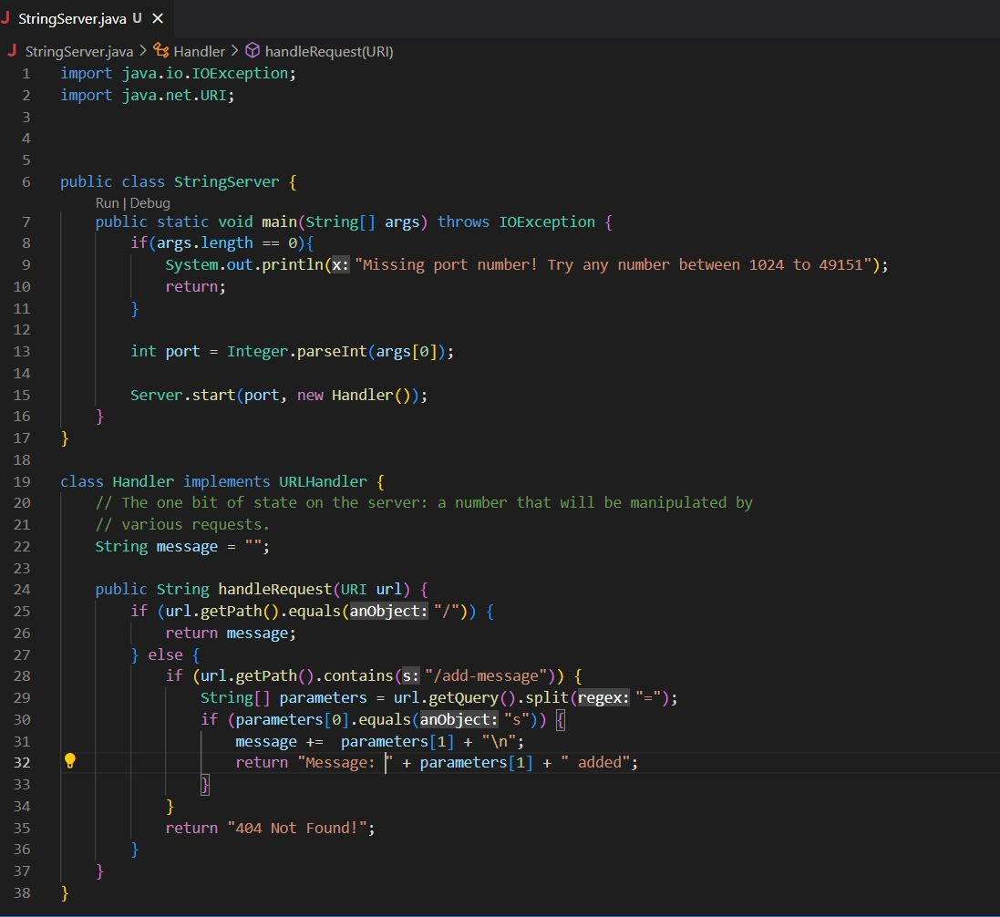
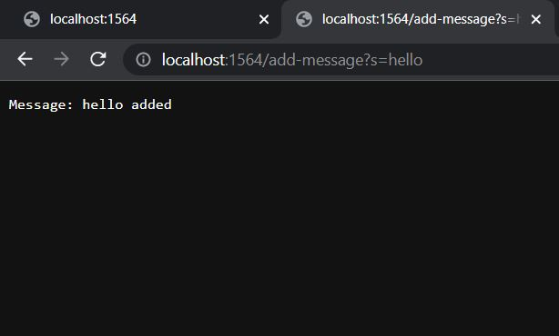
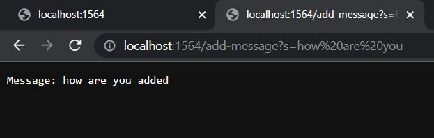
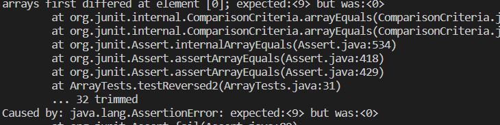

# Servers and Bugs

## Part 1 StringServer

This is the code I used to make the StringServer server:


And these are the two example messages I implemented:


and:



* For each these messages the code used the main method of the StringServer class and the handleRequest of the Handler class
* The main method was only called once to initialize the server, using a single int argument to specify the port that this server will use as an input, following that, each message added to the web server used the handleRequest method to concantanate a string to the message variable changing the displayed message on the web server.


## Part 2

In lab 3 there were numerous bugs in the code provided, one of them came from the ArrayExamples.java file, in the method named **reversed** an example of a failed test for this method is this:

```
@Test
public void testReversed2(){
  int[] input2 = {3, 5, 10, 9};
  assertArrayEquals(new int[]{9, 10, 5, 3}, ArrayExamples.reversed(input2));
  }
```
The example tester for this method, which did not reveal the bug, was:
```
@Test
public void testReversed(){
  int[] input1 = { };
  assertArrayEquals(new int[]{ }, ArrayExamples.reversed(input1));
  }
```
This was the failure that the first test displayed:



This was the code that caused the bug:
```
static int[] reversed(int[] arr){
  int[] newArray = new int[arr.length];
  for(int i = 0; i < arr.length; i++){
    arr[i] = newArray[arr.length - i - 1];
  }
  return arr;
}
```
and this is the code that fixed the bug:
```
static int[] reversed(int[] arr){
  int[] newArray = new int[arr.length];
  for(int i = 0; i < arr.length; i++){
    newArray[i] = arr[i];
  }
  for(int i = 0; i < arr.length; i++){
    arr[i] = newArray[arr.length - i - 1];
  }
  return arr;
}
```

## Part 3
