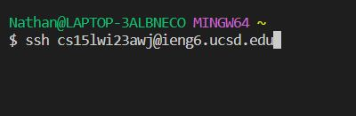
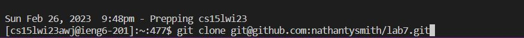
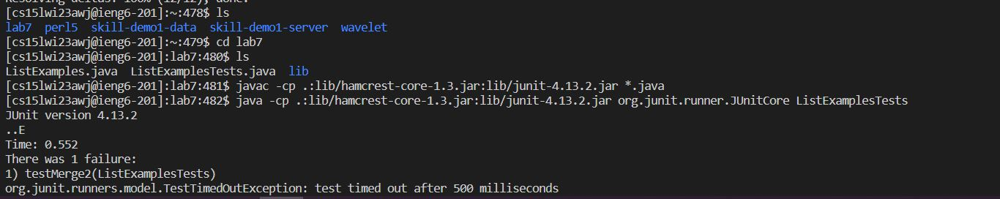
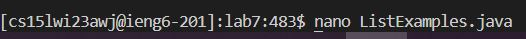
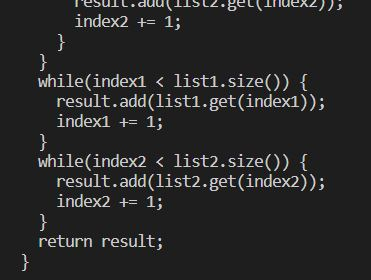
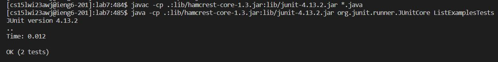
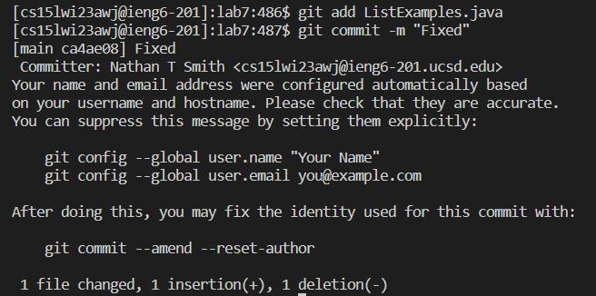

# Speed Challenge

## Step 4
First thing you need to do is log into your iegn6 account, I did this by typing ```cs15lwi23awj@ieng6.ucsd.edu```, if you have created a ssh key already then that will be all that is needed, otherwise you will need to put in your password as well.



## Step 5
Then I cloned the directory onto the account by first copying the ssh version of the url from the forked repository on github and then typing ```git clone <ctrl>c``` to input this to the terminal: 


## Step 6
Here, although unnecessary, I used ```ls``` to confirm that the directory lab7 had been cloned, then I used ```cd lab7``` to change my directory before copy pasting the javac and java commands for junit testing, inputting: ```<ctrl>c``` then ```<ctrl>c L<tab>Tests``` to run the tests.


## Step 7



## Step 8


## Step 9

